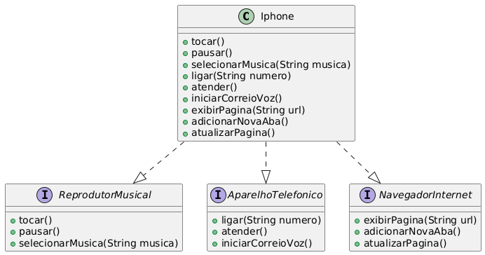

# Desafio de Modelagem UML do iPhone

Este projeto implementa as funcionalidades de um iPhone (Reprodutor Musical, Aparelho Telefônico e Navegador de Internet) utilizando interfaces Java para representar os diferentes papéis do aparelho.

## Diagrama de Classes UML

